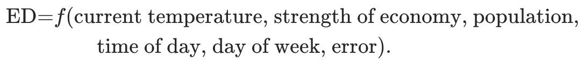
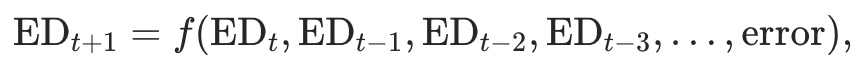
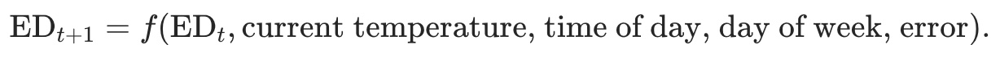

# 1.4 预测数据和方法

恰当的预测方法在很大程度上依赖于有什么样的可用数据。

如果没有可用数据，或者可用数据与预测无关，则必须使用**定性预测**方法。
这些方法并非纯粹的猜测 - 有很好的结构化方法可以在不使用历史数据的情况下获得良好的预测。
这些方法在[第4章](judgmental.md＃judgmental)中予以讨论。

当满足以下两个条件时，可以应用**定量预测**：

1. 有可用的与过去相关的数值信息；
1. 可以合理地假设，过去模式的某些方面将持续到未来。

定量预测方法广泛存在，通常是针对特定目的在特定学科内开发的。
在选择特定方法时，每种方法都有自己的属性，精度和成本须要考虑。

大多数定量预测问题使用时间序列数据（随时间定期收集）或横截面数据（在单个时间点收集）。在本书中，我们关注预测未来数据，并且我们专注于时间序列领域。

## 时间序列预测
时间序列数据的示例包括：

* 每日IBM股票价格
* 每月降雨量
* 亚马逊的季度销售业绩
* 谷歌年度利润

随时间顺序观察到的任何事物都是时间序列。在本书中，我们将仅考虑定期（例如，每小时、每天、每周、每月、每季度、每年）观察到的时间序列。不规则间隔的时间序列也可能会出现，但这超出了本书的范围。

When forecasting time series data, the aim is to estimate how the sequence of observations will continue into the future. Figure 1.1 shows the quarterly Australian beer production from 1992 to the second quarter of 2010.

Figure 1.1: Australian quarterly beer production: 1992Q1–2010Q2, with two years of forecasts.

The blue lines show forecasts for the next two years. Notice how the forecasts have captured the seasonal pattern seen in the historical data and replicated it for the next two years. The dark shaded region shows 80% prediction intervals. That is, each future value is expected to lie in the dark shaded region with a probability of 80%. The light shaded region shows 95% prediction intervals. These prediction intervals are a useful way of displaying the uncertainty in forecasts. In this case the forecasts are expected to be accurate, and hence the prediction intervals are quite narrow.

The simplest time series forecasting methods use only information on the variable to be forecast, and make no attempt to discover the factors that affect its behaviour. Therefore they will extrapolate trend and seasonal patterns, but they ignore all other information such as marketing initiatives, competitor activity, changes in economic conditions, and so on.

Time series models used for forecasting include decomposition models, exponential smoothing models and ARIMA models. These models are discussed in Chapters 6, 7 and 8, respectively.

## Predictor variables and time series forecasting

Predictor variables are often useful in time series forecasting. For example, suppose we wish to forecast the hourly electricity demand (ED) of a hot region during the summer period. A model with predictor variables might be of the form

The relationship is not exact — there will always be changes in electricity demand that cannot be accounted for by the predictor variables. The “error” term on the right allows for random variation and the effects of relevant variables that are not included in the model. We call this an explanatory model because it helps explain what causes the variation in electricity demand.

Because the electricity demand data form a time series, we could also use a time series model for forecasting. In this case, a suitable time series forecasting equation is of the form

where  
t
  is the present hour,  
t
+
1
  is the next hour,  
t
−
1
  is the previous hour,  
t
−
2
  is two hours ago, and so on. Here, prediction of the future is based on past values of a variable, but not on external variables which may affect the system. Again, the “error” term on the right allows for random variation and the effects of relevant variables that are not included in the model.

There is also a third type of model which combines the features of the above two models. For example, it might be given by

These types of “mixed models” have been given various names in different disciplines. They are known as dynamic regression models, panel data models, longitudinal models, transfer function models, and linear system models (assuming that  
f
  is linear). These models are discussed in Chapter 9.

An explanatory model is useful because it incorporates information about other variables, rather than only historical values of the variable to be forecast. However, there are several reasons a forecaster might select a time series model rather than an explanatory or mixed model. First, the system may not be understood, and even if it was understood it may be extremely difficult to measure the relationships that are assumed to govern its behaviour. Second, it is necessary to know or forecast the future values of the various predictors in order to be able to forecast the variable of interest, and this may be too difficult. Third, the main concern may be only to predict what will happen, not to know why it happens. Finally, the time series model may give more accurate forecasts than an explanatory or mixed model.

The model to be used in forecasting depends on the resources and data available, the accuracy of the competing models, and the way in which the forecasting model is to be used.
